# React Component Library - Test Assessment

A modern, reusable React component library built with TypeScript and Storybook.

## 🚀 Quick Start

### Installation

```bash
# Clone the repository
git clone https://github.com/Bohdan-Diatliuk/crewred-task.git
cd crewred-task

# Install dependencies
npm install

# Run Storybook
npm run storybook
```

The Storybook will open at [http://localhost:6006](http://localhost:6006)

### Build

```bash
# Build the project
npm run build

# Build Storybook
npm run build-storybook
```

## 📦 Components

### 1. Input Component

A versatile input component with multiple types, variants, and features.

**Features:**
- Multiple input types (text, password, email, number, tel, url)
- Password visibility toggle with eye icon
- Clearable functionality
- Two variants: outlined and filled
- Three sizes: small, medium, large
- Error state with validation messages
- Full width option
- Controlled and uncontrolled modes

**Usage:**
```tsx
import { Input } from './components/Input/Input';

<Input
  label="Email"
  type="email"
  placeholder="Enter your email"
  clearable
  error="Invalid email"
/>
```

**Screenshots:**

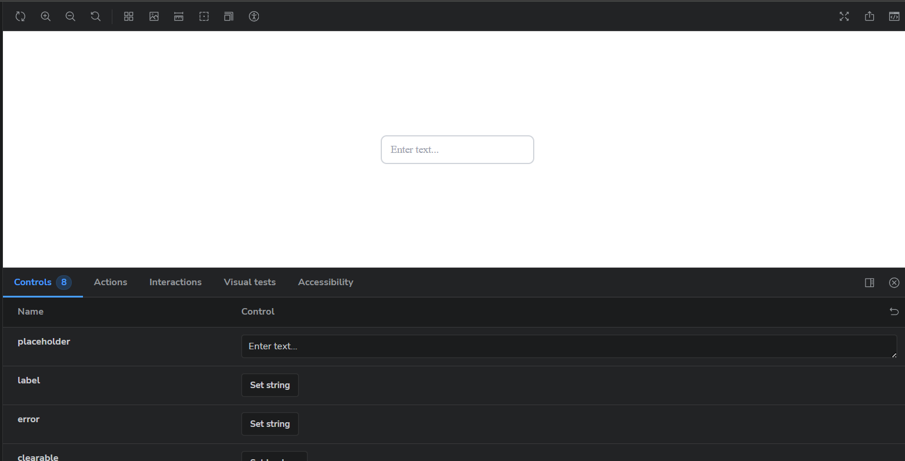
*Default input with label*

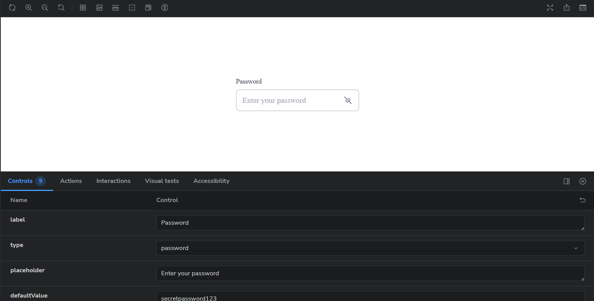
*Password input with visibility toggle*

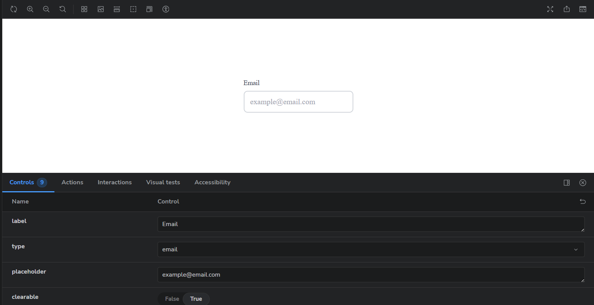
*Input with clear button*


*Input with error message*

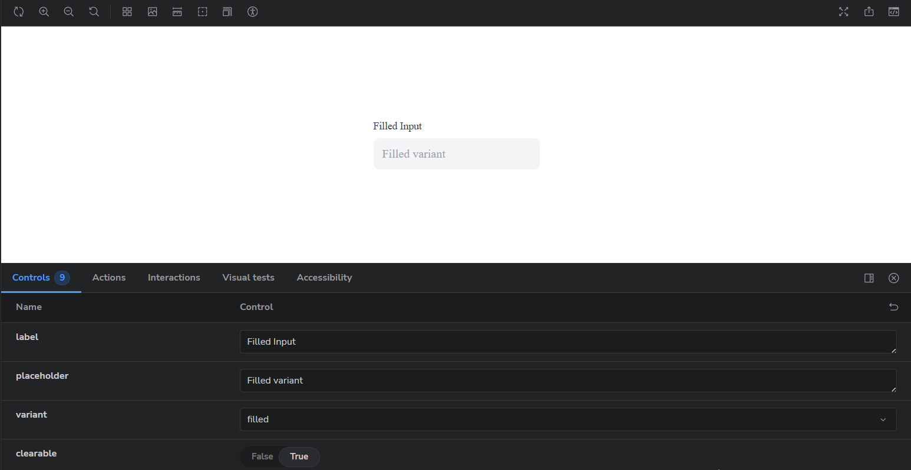
*Outlined and Filled variants*

---

### 2. Toast Component

A notification component with smooth animations and multiple types.

**Features:**
- 4 types: success, error, warning, info
- Auto-dismiss with configurable duration
- Manual close button (optional)
- Smooth fade and slide animations
- Stacking support for multiple toasts
- Responsive design

**Usage:**
```tsx
import { Toast } from './components/Toast/Toast';

<Toast
  type="success"
  message="Operation completed!"
  duration={4000}
  onClose={() => console.log('closed')}
  showCloseButton
/>
```

**Screenshots:**

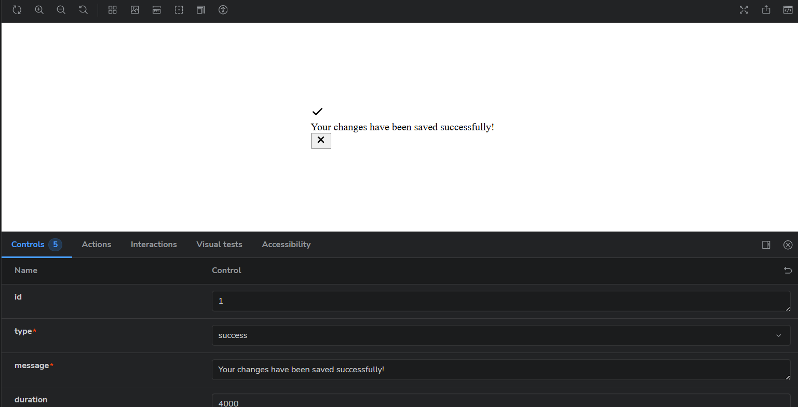
*Success notification*

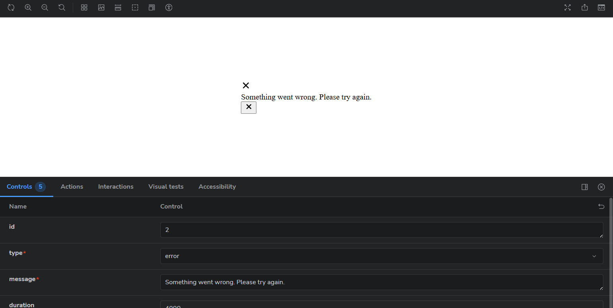
*Error notification*

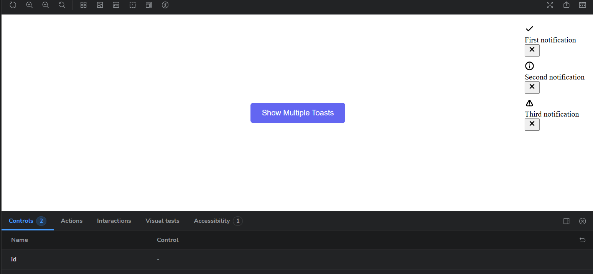
*Multiple stacked notifications*

---

### 3. SidebarMenu Component

A sliding sidebar navigation with nested menu support.

**Features:**
- Slides in from the right with smooth animation
- Support for 1-2 levels of nesting
- Expandable/collapsible submenus
- Backdrop click to close
- Keyboard support (ESC to close)
- Custom width option
- Icons support
- Responsive design

**Usage:**
```tsx
import { SidebarMenu } from './components/SidebarMenu/SidebarMenu';

const items = [
  { id: '1', label: 'Dashboard', icon: '📊', href: '/dashboard' },
  {
    id: '2',
    label: 'Products',
    icon: '📦',
    children: [
      { id: '2-1', label: 'All Products', href: '/products' },
      { id: '2-2', label: 'Categories', href: '/products/categories' }
    ]
  }
];

<SidebarMenu
  isOpen={isOpen}
  onClose={() => setIsOpen(false)}
  items={items}
  title="Navigation"
  width={320}
/>
```

**Screenshots:**

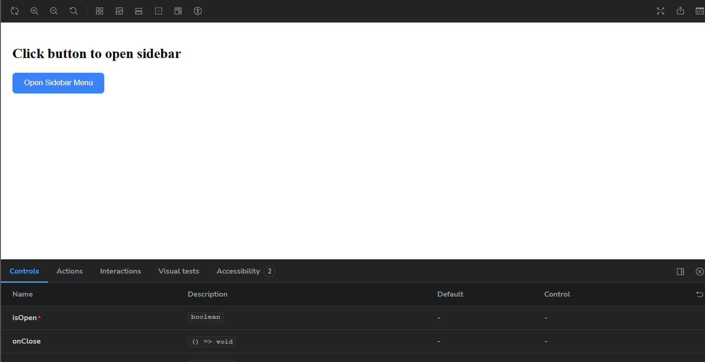
*Closed state with trigger button*

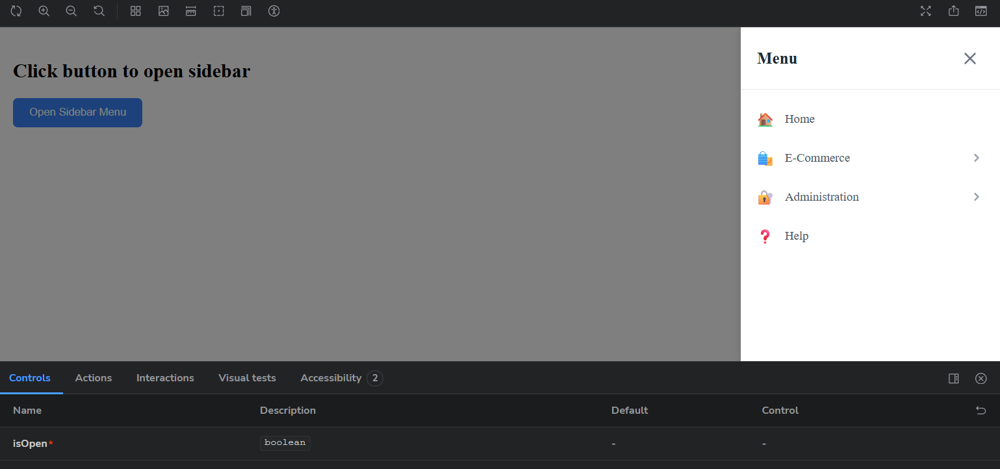
*Open sidebar with menu items*

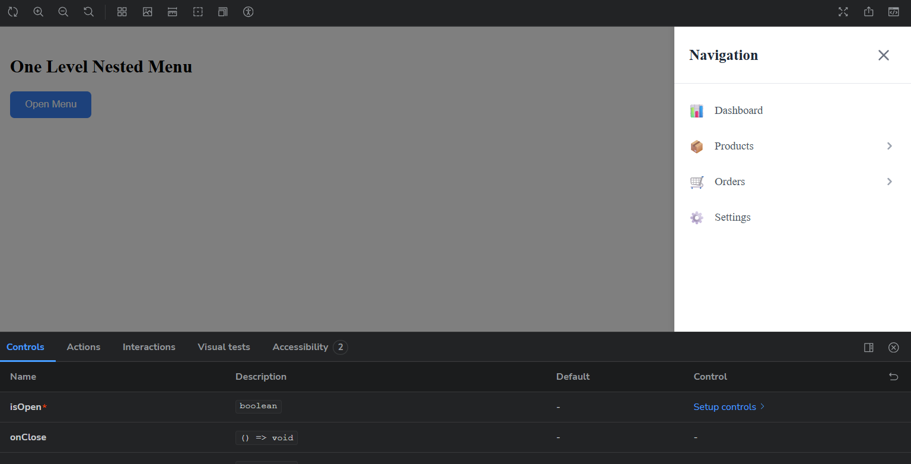
*Expanded nested submenu*

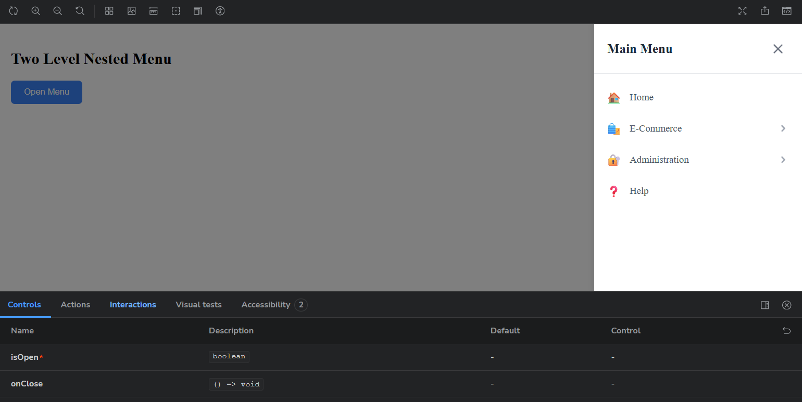
*Two-level nested navigation*

---

## 🎨 Storybook

All components are documented in Storybook with multiple states and variations.

### Stories included:
- **Input**: Default, Password, Clearable, Error, Sizes, Variants, Controlled
- **Toast**: Success, Error, Warning, Info, Interactive Demo, Multiple Toasts
- **SidebarMenu**: Simple, One-level nested, Two-level nested, Custom width, Interactive

## 🛠️ Tech Stack

- **React 19** - UI library
- **TypeScript** - Type safety
- **Vite** - Build tool
- **Storybook 10** - Component documentation
- **CSS Modules** - Scoped styling
- **clsx** - Conditional classnames

## 📁 Project Structure

```
crewred-task/
├── src/
│   ├── components/
│   │   ├── Input/
│   │   │   ├── Input.tsx
│   │   │   ├── Input.types.ts
│   │   │   └── Input.module.css
│   │   ├── Toast/
│   │   │   ├── Toast.tsx
│   │   │   ├── Toast.types.ts
│   │   │   └── Toast.module.css
│   │   └── SidebarMenu/
│   │       ├── SidebarMenu.tsx
│   │       ├── SidebarMenu.types.ts
│   │       └── SidebarMenu.module.css
│   └── index.ts
├── stories/
│   ├── Input.stories.tsx
│   ├── Toast.stories.tsx
│   └── SidebarMenu.stories.tsx
└── .gitignore
```

## 🧪 Code Quality

- **ESLint** configured for React and TypeScript
- **Strict TypeScript** settings enabled
- **Functional components** with React Hooks
- **CSS Modules** for scoped styling
- **Accessible** markup with ARIA attributes

## 📝 Component Props

### Input Props
```typescript
interface InputProps {
  label?: string;
  error?: string;
  clearable?: boolean;
  fullWidth?: boolean;
  variant?: 'outlined' | 'filled';
  inputSize?: 'small' | 'medium' | 'large';
  type?: string;
  value?: string;
  onChange?: (e: React.ChangeEvent<HTMLInputElement>) => void;
  onClear?: () => void;
  // ... extends all HTML input attributes
}
```

### Toast Props
```typescript
interface ToastProps {
  type: 'success' | 'error' | 'warning' | 'info';
  message: string;
  duration?: number;
  onClose?: () => void;
  showCloseButton?: boolean;
}
```

### SidebarMenu Props
```typescript
interface SidebarMenuProps {
  isOpen: boolean;
  onClose?: () => void;
  items: MenuItem[];
  title?: string;
  width?: number;
}

interface MenuItem {
  id: string;
  label: string;
  icon?: React.ReactNode | string;
  href?: string;
  onClick?: () => void;
  children?: MenuItem[];
}
```

## 🎯 Features Implemented

✅ Smart Input component with password toggle and clear functionality  
✅ Toast notifications with auto-dismiss and animations  
✅ Nested Sidebar Menu with sliding animation  
✅ Full TypeScript support  
✅ Comprehensive Storybook documentation  
✅ Responsive design  
✅ Accessibility features  
✅ Clean and modular code structure  

## 👤 Author

Bohdan Diatliuk - [GitHub Profile](https://github.com/yourusername)